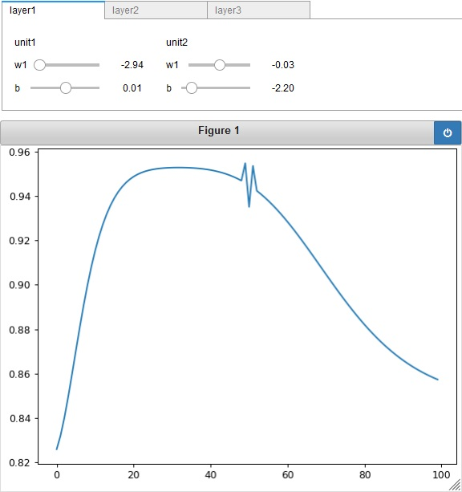
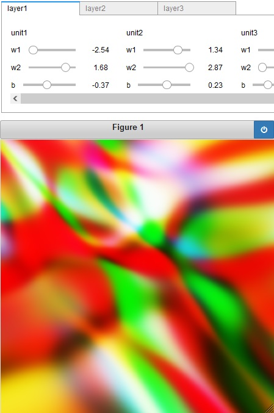

# basic_nn
Visualize the expressivity of basic neural networks.

### Requirements
- numpy
- matplotlib
- ipywidgets

## 1d_nn.ipynb
Visualizer of functions (1d).

## 2d_nn.ipynb
Visualizer of images (2d).

